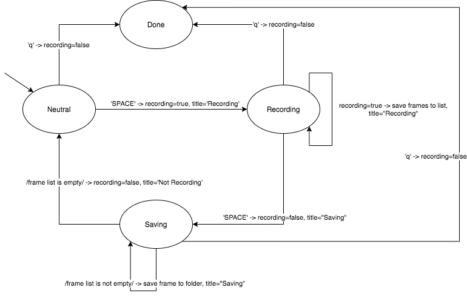

# CS497 Gesture Controlled Drone

## Introduction
A final project for CS497: Computer Vision at Western Colorado University. Our goal is to control a DJI Tello EDU drone via hand gestures.

Our process and attempts:
1. Optical flow flight path replication from a recorded video - we found limitations with the camera and model in conjunction with large movements
1. Follow a user, but this had implications of human tracking/identification, and tracking in 3D space requires far more time/cognition than we had time for
1. Self-constructed gesture recognition CNN, but our training data was limited and known methodology was lacking
1. Mediapipe supported recognition, this was very successful and allowed us to focus on integrating outputs from the model with flight controls

Results, and stuff we learned:
 - Training data management
 - Spiradicness of a live motor controlled device
 - System state management
 - Handling recognizing actions from a generic human

Signed; Marcos Ordonos, Jake Teeter, and Andrew Nyland

## Scripts

### Preprocessing
These scripts handle recording training data and preprocessing the data to make it more useful, or more advantageous for a neural network to be applied.

 - `create.py`: Initial blurring and processing of recorded images from the drone of hand gestures 
 - `preprocessing.py`: generates one-to-many of images
     - generated images are brightness adjusted and edges detected

#### CNN Training

 - `droneCNN.py`: saves a CNN model on recorded training images

#### CNN Inference

 - `drone.py`: Tests label identification of the CNN on a live feed from the drone
 - `drone_t.py`: Same as drone.py but with mediapipe integration

#### Utilities

 - `test1.py`: Basic flight path of the drone; takes off, flies while tracing a 1m cube, rotates 90 degrees, and repeats that flight path before landing
 - `test2.py`: Same as test1.py with video streaming
 - `test3.py`: Same as test2.py with optical flow implemented
 - `getspecs.py`: Basic situational information about the drone, no controls
 - `recframes.py`: Records frames from live stream for training data, no flight
     - 'SPACE' for start/stop recording, this is represented in the menubar of the live feed view
     - 'q'/'Q' to exit the program
     - uses counter.txt to count recordings and saves frames to a folder as individual images

#### Supplemental
 - `counter.txt`: a necessary text file for recframes.py, if used by a new user we recommend filling this file with a string of '-1' (as such, it will start at 0)


### More Information

Below is a sample output for `getspecs.py`:
```
[INFO] tello.py - 122 - Tello instance was initialized. Host: '192.168.10.1'. Port: '8889'.
[INFO] tello.py - 437 - Send command: 'command'
[INFO] tello.py - 461 - Response command: 'ok'
Battery: 100
Temperature: (55, 59)
Barometer: 232850.0
RPY: 0, 0, -153
```

Below is a state machine representation of `recframes.py`:



## References
 - [Tello API reference](https://github.com/damiafuentes/DJITelloPy/blob/master/djitellopy/tello.py)
 - [Watershed algorithm](https://www.bogotobogo.com/python/OpenCV_Python/python_opencv3_Image_Watershed_Algorithm_Marker_Based_Segmentation.php)
### DJI Tello Hand Gesture control: 
 - [Tello Gesture Control git repo](https://github.com/kinivi/tello-gesture-control)
 - [TF hand gesture recognition tutorial](https://techvidvan.com/tutorials/hand-gesture-recognition-tensorflow-opencv/)
 - [mediapipe](https://www.section.io/engineering-education/creating-a-hand-tracking-module/)
### Code sources
 - [Project git repository](https://github.com/Jaketa-CS/CS497_OptimalFlowDrone)
 - [Link to access image on ONEdRIVE](https://westernstatecoloradou-my.sharepoint.com/:u:/g/personal/marcos_ordonez_western_edu/EXoWoUeohZdKk-me1iAHF-gBABaIlLkrLvVN05MPQsLT3w?e=ltUGxq) (Western Colorado University account required)
